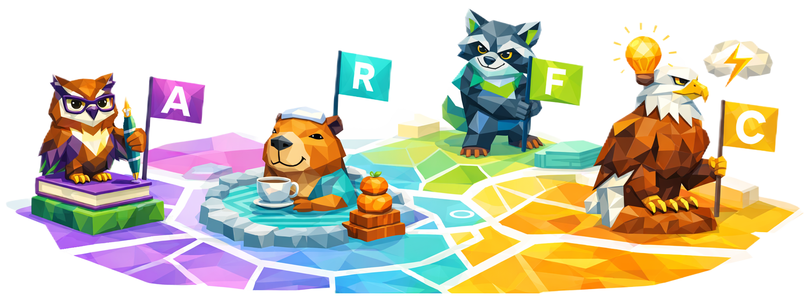
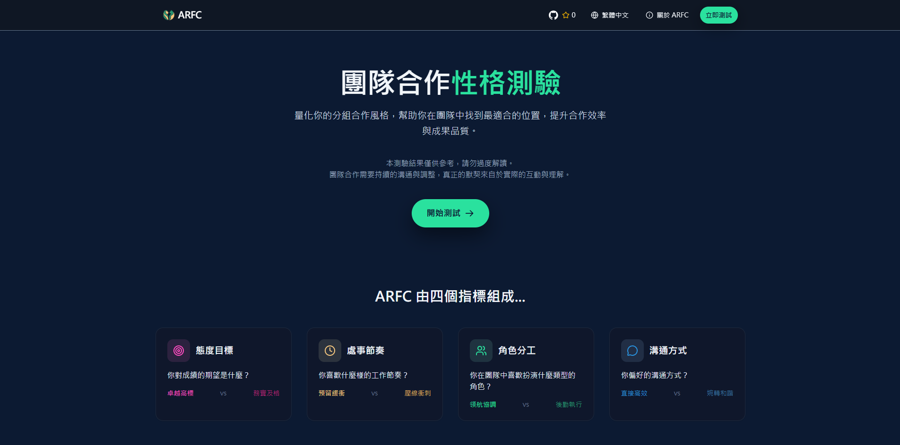
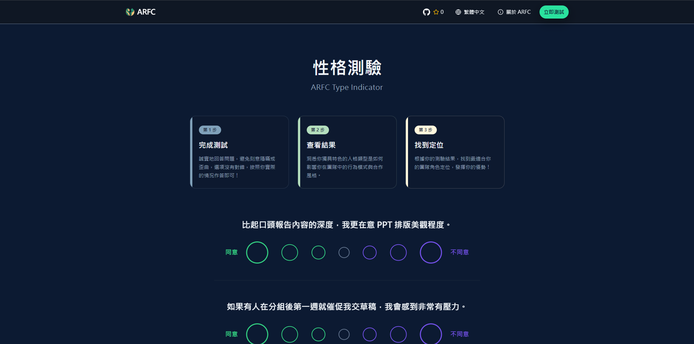
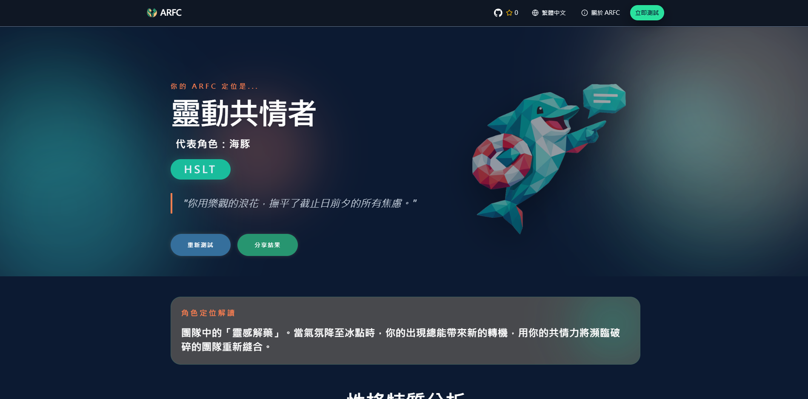
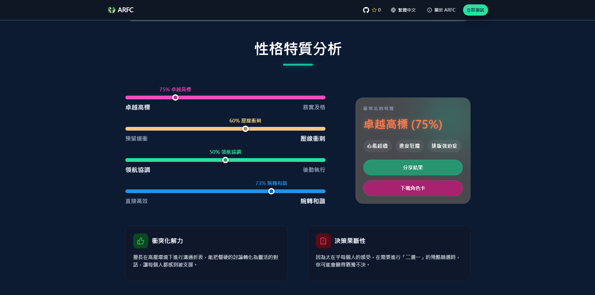

# ARFC - 團隊合作性格測驗網站

> *「分組作業是大學生的修煉場，而我們只是想幫你找個好隊友。」*<br>
> 期望能透過四十多條問題，幫助你在分組時先了解彼此的合作性格，降低分組後的摩擦與誤解，讓小組之間的合作更加順利。

[](https://opensource.org/licenses/GPL-3.0)


Techstack:<br>


| <span style="color:#FF99CC">📢 覺得有趣的話，歡迎分享給你的朋友！</span><br> | [來測！](https://arfc.voc2048.com) |
|-|-|
| <span style="color:#05C189">📧 提出建議或回報問題</span><br>| [歡迎 Issue 告訴我們](https://github.com/Vocaloid2048/ARFC/issues) |

## <span style="color:#C3D630"> 🚧 請留意！
### 本測試僅供參考，當中評級/結果未經學術研究認證
- 請勿過於較真或將測試結果當成絕對的標籤
- 真正的合作默契要靠實際相處來培養

### 資料收集方面
- 我們不會收集任何個人敏感資料
- 所有測試結果僅儲存於您目前的瀏覽器本地快取


## <span style="color:#569CD6">🏞️ 螢幕截圖</span>
|||
|-|-|
|||

## <span style="color:#569CD6">🧪 專為「小組作業」設計的四個維度
這個系統不談抽象的人格，我們只談在分組中最容易出意外的部分。其實主要就是成績、截止日期、分工、溝通這四個方面的問題。
> 只要這四個維度對上了，合作的痛苦指數能降不少（我猜）。

- **A (Attitude - 態度目標)**：你對成績的期望是什麼？（卓越高標 vs 務實及格）
- **R (Rhythm - 處事節奏)**：你喜歡什麼樣的工作節奏？（預留緩衝 vs 壓線衝刺）
- **F (Function - 角色分工)**：你在團隊中喜歡扮演什麼類型的角色？（領航協調 vs 後勤執行）
- **C (Communication - 溝通方式)**：你偏好的溝通方式？（直接高效 vs 婉轉和諧）

## <span style="color:#569CD6">✨ 專案特色
- ✅ **情境導向題庫**：覆蓋大學生最真實的分組痛點（如：上台演講、設deadline、報告排版要求等）。
- ✅ **角色定位**：根據 ARFC 算法，自動為你分配最合適的團隊身分。
- ✅ **性格特質分析**：指出對應的「優勢天賦」與「發展盲區」，讓你更了解自己。

## ✒️翻譯有問題！/ 也想幫忙...
- 各位大大可以到 
  - [Coding Band](https://discord.gg/uXatcbWKv2) 的  [👾｜問題發表｜questions](https://discord.com/channels/880921456903618610/1067563572865024223) 提出
  - 亦可以直接在 [專案討論頻道](https://discord.com/channels/880921456903618610/1494407530602958939) 提出建議
  - 也歡迎在 [GitHub Repo](https://github.com/Vocaloid2048/PEAK-zh-tw-Translation/) 透過提交 Issues 給予建議
  - 如果有翻譯上的PR也是十分歡迎的~
- 這邊看到後會儘快審視和添加您的翻譯/建議！
- 為了避免朝令夕改，所以每次更新都會堆積一定量才推出，懇請諒解
- **如真的很有需要，或者長時間沒收到答覆**，請先加入Discord伺服器，然後在私訊我：`vocaloid2048`
  - 直接説問題就好！不要只加好友，不然會被當作釣魚處理

## 💻 如何在本地運行
<details>

```bash
# 1. 克隆專案
git clone https://github.com/Vocaloid2048/ARFC.git

# 2. 進入目錄
cd ARFC

# 3. 安裝依賴
npm install

# 4. 啟動開發伺服器
npm run dev
```
</details>

## 📂 專案結構
<details>

```
ARFC
├─docs                          # README.md 相關圖片資源
├─public
│  └─role_images                # 角色圖片
├─src
│    ├─assets
│    │  ├─data                   # 問題與角色數據
│    │  │  ├─question_data.json  # 問題與角色數據
│    │  │  └─role_data.json      # 角色數據
│    │  └─lang                   # 多語系翻譯文件
│    ├─components                # 可重用的 UI 元件
│    ├─pages                     # 各個頁面
│    │  ├─About.jsx              # 關於頁面
│    │  ├─Home.jsx               # 首頁
│    │  ├─Quiz.jsx               # 測驗頁面
│    │  └─Result.jsx             # 結果頁面
│    └─utils                     # 工具函數與算法
├─App.jsx                        # 主應用程式入口
├─index.css                      # 全局樣式
└─main.jsx                       # React 入口
```
</details>

## 🙏 特別鳴謝
- 專案靈感來自 [ACGTI](https://acgti.tianxingleo.top/) by [tianxingleo](https://github.com/tianxingleo) 
- UI/UX 設計參考自 [16personalities](https://www.16personalities.com/)，部分界面設計亦參考自 [ACGTI](https://acgti.tianxingleo.top/)。
- AI 使用聲明：本項目大部分內容（包括但不限於文案、代碼、圖片）均由 AI 協助生成，具體如下：
  - 圖片：Copilot
  - 代碼：GitHub Copilot (GPT-5 mini、Gemini 3.1 Pro)
  - 文本：Gemini 3

### Contributors
<a href="https://github.com/vocaloid2048/ARFC/graphs/contributors">
  
</a>